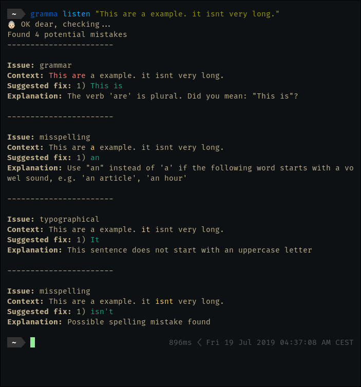

# Gramma - command line grammar checker

## Notes

This package is in a POC stage. It's functional, but limited and not unit tested.

## Installation

`npm i gramma -g`

## Usage

### Print possible mistakes for a file

`gramma check [file]`

### Print possible mistakes for a string

`gramma listen [text]`

Text should be quoted.

### Example output

### Licence

Projects is under open, non-restrictive [ISC licence](LICENCE)
