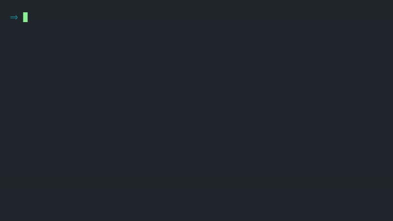

<h1 align="center" style="border: none">Gramma - command-line grammar checker</h1>

Gramma is an interactive tool that helps you find and fix grammatical mistakes in files and text strings. You can also use it in a non-interactive way, as a simple linter for automation processes.

Gramma works on Linux, Windows, and macOS.

Gramma supports many languages. You can find a full list <a href="https://languagetool.org/languages">here</a>.

Gramma works out-of-the-box, communicating with <a href="https://www.grammarbot.io/">grammarbot.io</a>, but can also be easily configured to work with other compatible APIs, including local or remote <a href="http://wiki.languagetool.org/http-server">LanguageTool</a> server.

<hr>
</div>

<div>

<a href="https://circleci.com/gh/caderek/gramma/tree/master" target="_blank"></a>


<a href="https://packagequality.com/#?package=gramma"></a>


</div>

<div style="margin-top: 30px;">

</div>

## Contents

1. [Installation](#installation)
1. [Usage](#usage)
   - [Check file](#usage-check)
   - [Check string](#usage-listen)
   - [Git commit with grammar check](#usage-commit)
   - [Command-line options](#usage-options)
1. [Configuration](#config)
   - [Introduction](#config-intro)
   - [Checker settings](#config-checker)
   - [Customizing API server](#config-server)
1. [Managing a local server](#server)
1. [JS API](#js)
1. [License](#license)

<a id='installation'></a>

## Installation

### Via NPM

It is the recommended way if you have Node.js and NPM already installed (or you are willing to do it).

#### Global installation:

```
npm i gramma -g
```

#### Local installation (as a dev tool for your project):

```
npm i gramma -D
```

### Via binary package

If you prefer a single binary file (Node.js included), you can download it for the most popular platforms:

- [gramma-linux64-v1.0.0.zip](https://github.com/caderek/gramma/releases/download/v1.0.0/gramma-linux64-v1.0.0.zip)
- [gramma-macos-v1.0.0.zip](https://github.com/caderek/gramma/releases/download/v1.0.0/gramma-macos-v1.0.0.zip)
- [gramma-windows64-v1.0.0.zip](https://github.com/caderek/gramma/releases/download/v1.0.0/gramma-windows64-v1.0.0.zip)

After downloading and unpacking the binary, add it to your PATH or create a symlink to your executable directory (depending on the platform).

### Installing local server

If you don't want to use a public API, you can install a local LanguageTool server:

```
gramma server install
```

For this to work, you have to install Java 1.8 or higher (you can find it [here](https://jdk.java.net/12/) or [here](https://www.oracle.com/technetwork/java/javase/downloads/jdk12-downloads-5295953.html)). You can check if you have it installed already by running:

```
java -version
```

That's it - Gramma will now use and manage the local server automatically.

<a id='usage'></a>

## Usage

<a id='usage-check'></a>

### Check file

Interactive fix:

```
gramma check [file]
```

Just print potential mistakes and return status code:

```
gramma check -p [file]
```

Examples:

```
gramma check path/to/my_file.txt
```

```
gramma check -p path/to/other/file.txt
```

<a id='usage-listen'></a>

### Check string

Interactive fix:

```
gramma listen [text]
```

Just print potential mistakes and return status code:

```
gramma listen -p [text]
```

Examples:

```
gramma listen "This sentence will be checked interactively."
```

```
gramma listen -p "Suggestions for this sentence will be printed."
```

<a id='usage-commit'></a>

### Git commit with grammar check

Equivalent to `git commit -m [message]`:

```
gramma commit [text]
```

Equivalent to `git commit -am [message]`:

```
gramma commit -a [text]
```

Examples:

```
gramma commit "My commit message"
```

```
gramma commit -a "Another commit message (files added)"
```

<a id='usage-options'></a>

### Command-line options

_Note: This section describes options for grammar-checking commands only. Other command-specific options are described in their respectful sections of this document._

- `-p / --print` - check text in the non-interactive mode
- `-n / --no-colors` - when paired with the `-p` flag, removes colors from the output
- `-d / --disable <rule>` - disable specific [rule](#available-rules)
- `-e / --enable <rule>` - enable specific [rule](#available-rules)
- `-l / --language <language_code>` - mark a text as written in provided [language](#available-languages)

You can enable or disable multiple rules in one command by using a corresponding option multiple times. You can also compound boolean options if you use their short version.

Example:

```
gramma listen "I like making mistkaes!" -pn -d typos -d typography -e casing -l en-GB
```

<a id='config'></a>

## Configuration

<a id='config-intro'></a>

### Introduction

With Gramma, you can use a global and local configuration file. Gramma will use a proper config file following their priority:

1. Command-line options
2. Local config
3. Global config
4. Default config

Gramma will automatically generate configuration files when you add something to your config via `gramma config` command.

If you want to manually initialize local config with default options, you can run the following command in your project's root directory:

```
gramma init
```

By doing so, your project will not depend on your user's setting. It is useful when you want to share your project with others, for example via Git repository.

You can check the path to the global configuration file (as well as other paths used by Gramma) via the following command:

```
gramma paths
```

Gramma creates the local configuration in your working directory under `.gramma.json` name.

You can change your settings by manually editing configuration files or running:

```
gramma config <setting> <value> [-g]
```

`-g` (`--global`) flag is optional and controls whether the global or the local config will be altered.

_Note: All examples below use the global config. If you want to use a local one, skip the `-g` flag._

<a id='config-checker'></a>

### Checker settings

#### Adding a word to the dictionary

Usually, you will add custom words to the local or global dictionary via interactive menu during the fix process, but you can also make it via separate command:

```
gramma config dictionary <your_word> -g
```

#### Changing default language

```
gramma config language <language_code> -g
```

<a id="available-languages"></a>

<details>
  <summary style="outline: none; cursor: pointer">Available languages (click to expand)</summary>
  <ul>
      <li><tt style="white-space: pre;">auto    </tt> - automatic language detection</li>
      <li><tt style="white-space: pre;">ast-ES  </tt> - Asturian</li>
      <li><tt style="white-space: pre;">be-BY   </tt> - Belarusian</li>
      <li><tt style="white-space: pre;">br-FR   </tt> - Breton</li>
      <li><tt style="white-space: pre;">ca-ES   </tt> - Catalan</li>
      <li><tt style="white-space: pre;">zh-CN   </tt> - Chinese</li>
      <li><tt style="white-space: pre;">da-DK   </tt> - Danish</li>
      <li><tt style="white-space: pre;">nl      </tt> - Dutch</li>
      <li><tt style="white-space: pre;">en      </tt> - English</li>
      <li><tt style="white-space: pre;">en-AU   </tt> - English (Australian)</li>
      <li><tt style="white-space: pre;">en-CA   </tt> - English (Canadian)</li>
      <li><tt style="white-space: pre;">en-GB   </tt> - English (GB)</li>
      <li><tt style="white-space: pre;">en-NZ   </tt> - English (New Zealand)</li>
      <li><tt style="white-space: pre;">en-ZA   </tt> - English (South African)</li>
      <li><tt style="white-space: pre;">en-US   </tt> - English (US)</li>
      <li><tt style="white-space: pre;">eo      </tt> - Esperanto</li>
      <li><tt style="white-space: pre;">fr      </tt> - French</li>
      <li><tt style="white-space: pre;">gl-ES   </tt> - Galician</li>
      <li><tt style="white-space: pre;">de      </tt> - German</li>
      <li><tt style="white-space: pre;">de-AT   </tt> - German (Austria)</li>
      <li><tt style="white-space: pre;">de-DE   </tt> - German (Germany)</li>
      <li><tt style="white-space: pre;">de-CH   </tt> - German (Swiss)</li>
      <li><tt style="white-space: pre;">el-GR   </tt> - Greek</li>
      <li><tt style="white-space: pre;">it      </tt> - Italian</li>
      <li><tt style="white-space: pre;">ja-JP   </tt> - Japanese</li>
      <li><tt style="white-space: pre;">km-KH   </tt> - Khmer</li>
      <li><tt style="white-space: pre;">fa      </tt> - Persian</li>
      <li><tt style="white-space: pre;">pl-PL   </tt> - Polish</li>
      <li><tt style="white-space: pre;">pt      </tt> - Portuguese</li>
      <li><tt style="white-space: pre;">pt-AO   </tt> - Portuguese (Angola preAO)</li>
      <li><tt style="white-space: pre;">pt-BR   </tt> - Portuguese (Brazil)</li>
      <li><tt style="white-space: pre;">pt-MZ   </tt> - Portuguese (Moçambique preAO)</li>
      <li><tt style="white-space: pre;">pt-PT   </tt> - Portuguese (Portugal)</li>
      <li><tt style="white-space: pre;">ro-RO   </tt> - Romanian</li>
      <li><tt style="white-space: pre;">ru-RU   </tt> - Russian</li>
      <li><tt style="white-space: pre;">sk-SK   </tt> - Slovak</li>
      <li><tt style="white-space: pre;">sl-SI   </tt> - Slovenian</li>
      <li><tt style="white-space: pre;">es      </tt> - Spanish</li>
      <li><tt style="white-space: pre;">sv      </tt> - Swedish</li>
      <li><tt style="white-space: pre;">tl-PH   </tt> - Tagalog</li>
      <li><tt style="white-space: pre;">ta-IN   </tt> - Tamil</li>
      <li><tt style="white-space: pre;">uk-UA   </tt> - Ukrainian</li>
  </ul>
</details>

_Note: By default, Gramma uses US English (`en-US`)._

#### Enabling and disabling rules

Enabling a specific rule:

```
gramma config enable <rule_name> -g
```

Disabling a specific rule:

```
gramma config disable <rule_name> -g
```

<a id="available-rules"></a>

<details>
  <summary style="outline: none; cursor: pointer">Available rules (click to expand)</summary>
  <ul>
      <li><tt style="white-space: pre;">casing</tt></li>
      <li><tt style="white-space: pre;">colloquialisms</tt></li>
      <li><tt style="white-space: pre;">compounding</tt></li>
      <li><tt style="white-space: pre;">confused_words</tt></li>
      <li><tt style="white-space: pre;">false_friends</tt></li>
      <li><tt style="white-space: pre;">gender_neutrality</tt></li>
      <li><tt style="white-space: pre;">grammar</tt></li>
      <li><tt style="white-space: pre;">misc</tt></li>
      <li><tt style="white-space: pre;">punctuation</tt></li>
      <li><tt style="white-space: pre;">redundancy</tt></li>
      <li><tt style="white-space: pre;">regionalisms</tt></li>
      <li><tt style="white-space: pre;">repetitions</tt></li>
      <li><tt style="white-space: pre;">semantics</tt></li>
      <li><tt style="white-space: pre;">style</tt></li>
      <li><tt style="white-space: pre;">typography</tt></li>
      <li><tt style="white-space: pre;">typos</tt></li>
  </ul>
</details>

You can find a description of each rule [here](https://languagetool.org/development/api/org/languagetool/rules/Categories.html).

_Note: By default, all rules are enabled._

<a id='config-server'></a>

### Customizing API server

#### Defining custom API endpoint

If you want to use remote LanguageTool server, or use one already installed in your system (not installed via `gramma server install`), you can define a custom API endpoint:

```
gramma config api_url <custom_api_endpoint> -g
```

Example

```
gramma config api_url http://my-custom-api-url.xyz/v2/check -g
```

#### Running local server only when needed

If you do not want the local server to run all the time, you can configure Gramma to run it only when needed (`run -> check -> close`). It is useful when you run Gramma only from time to time and want to lower the memory consumption:

```
gramma config server_once true -g
```

_Note: This setting requires the `-g` flag because all local API server settings are stored in the global config._

#### Adding API key

_Note: This option applies to grammarbot.io and languagetoolplus.com API only._

If you use our default API (grammarbot.io), it comes with some limitations - 100 checks per day (which is fine for most users). You can increase that limit to 250 by registering on [grammarbot.io/signup](https://www.grammarbot.io/signup) (it's free).

You can also buy a paid option on grammarbot.io or languagetoolplus.com, which both offer some additional checks.

In both cases, when you register, you will receive an API key that you can use in Gramma:

```
gramma config api_key <your_api_key> -g
```

<a id='server'></a>

## Managing a local server

If you have [configured a custom API server](#config), Gramma will manage the server automatically - nevertheless, there might be situations when you want to manage server manually. Gramma simplifies this by exposing basic server commands:

#### Starting server

```
gramma server start
```

_Note: When you use this command, Gramma will ignore `server_once` config option. This is expected behavior - I assume that if you use this command, you want the server to actually run, not stop after the first check._

#### Stopping server

```
gramma server stop
```

#### Getting server PID

```
gramma server pid
```

#### Opening built-in GUI

```
gramma server gui
```

<a id='js'></a>

## JS API

In addition to command-line usage, you can use two exposed methods if you want to handle mistakes by yourself.

#### check() method

Returns a promise with a check result.

```js
const { check } = require("gramma")

check("Some text to check.").then(console.log)
```

You can also pass a second argument - an options object. Available options:

- `api_url` - url to a non-default API server
- `api_key` - server API key
- `dictionary` - an array of words that should be whitelisted
- `language` - language code to specify the text language
- `rules` - object defining which rules should be disabled

<details>
<summary style="outline: none; cursor: pointer">Default options object (click to expand)</summary>
<pre>
{
  "api_url": "http://api.grammarbot.io/v2/check",
  "api_key": "",
  "dictionary": [],
  "language": "en-US",
  "rules": {
    "casing": true,
    "colloquialisms": true,
    "compounding": true,
    "confused_words": true,
    "false_friends": true,
    "gender_neutrality": true,
    "grammar": true,
    "misc": true,
    "punctuation": true,
    "redundancy": true,
    "regionalisms": true,
    "repetitions": true,
    "semantics": true,
    "style": true,
    "typography": true,
    "typos": true
  }
}
</pre>
</details>

You can find all available values for each setting in the [configuration section](#config) of this document.

Example with all options set:

```js
const { check } = require("gramma")

check("Some text to check.", {
  api_url: "http://my-custom-language-tool-server.xyz/v2/check",
  api_key: "SOME_API_KEY",
  dictionary: ["npm", "gramma"],
  language: "pl-PL",
  rules: {
    typography: false,
    casing: false,
  },
}).then(console.log)
```

#### replaceAll() method

Replaces words with provided ones. It takes an array of objects in the following format:

```js
const exampleReplacements = [
  { offset: 6, length: 3, change: "correct phrase" },
  { offset: 20, length: 7, change: "another phrase" },
]
```

You can find proper `offset` and `length` values in the object returned by `check()` method.

Example usage:

```js
const { check, replaceAll } = require("gramma")

/** Your custom function **/
const prepareReplacements = (matches) => {
  // your code...
}

const fix = async (text) => {
  const { matches } = await check(text)
  const replacements = prepareReplacements(matches)

  return replaceAll(text, replacements)
}

const main = () => {
  const correctText = await fix("Some text to check")
  console.log(correctText)
}

main()
```

<a id='license'></a>

## License

Project is under open, non-restrictive [ISC license](LICENSE).
